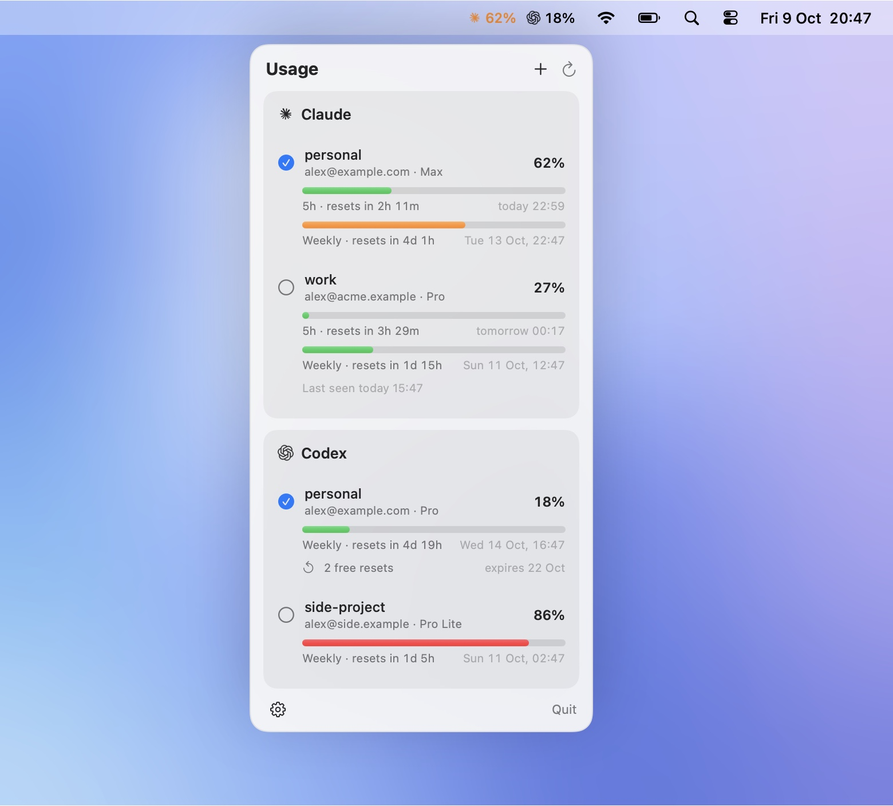

# AI Usage

Your Claude and Codex usage limits, one glance away in the macOS menu bar — and one click to
switch between your accounts.

<p align="center">
  <picture>
    <source media="(prefers-color-scheme: dark)" srcset="docs/screenshots/desktop-dark.jpg">
    
  </picture>
</p>

- **Menu bar** — the most used limit of each provider, colored only when it matters
  (orange from 50 %, red from 80 %).
- **Panel** — every limit with its countdown and exact reset time: Claude's 5-hour, weekly and
  per-model windows, Codex's windows and free resets.
- **Accounts** — save several Claude Code and Codex accounts, switch with a click or from the
  terminal (`ccx`, `cx`).
- **Status line** for Claude Code: `Opus 5.5 │ cache 47m │ session: 3h29 5% │ weekly: 5d 2%`.
- **Settings** (⚙︎): open at login, English or French.

## Install

Requires macOS 14+, the Xcode Command Line Tools (`xcode-select --install`) and `jq`.
Claude Code and the Codex CLI are each optional.

```sh
git clone https://github.com/MathFreedom/ai-usage && cd ai-usage
./install.sh
```

This builds `~/Applications/AI Usage.app`, links `cx` and `ccx` into `~/.local/bin` (add it to
your `PATH` if needed) and sets the Claude Code status line. A status line you already had keeps
running in the background, so its integrations keep working. Then save the accounts you're
signed in with:

```sh
ccx save    # Claude Code
cx save     # Codex
```

## Accounts from the terminal

| | Claude Code | Codex |
|---|---|---|
| List with usage | `ccx` | `cx` |
| Save the current account | `ccx save [name]` | `cx save [name]` |
| Add another account (browser sign-in) | `ccx add [name]` | `cx add [name]` |
| Switch | `ccx use <name>` | `cx use <name>` |
| Forget | `ccx rm <name>` | `cx rm <name>` |

Adding an account never signs out the active one. After a switch, restart Claude Code sessions
that were already open; `cx` restarts the Codex daemon itself, but the ChatGPT app and IDE
extensions need a restart.

## How it works

- **Usage** is read from the endpoints the official clients use:
  `api.anthropic.com/api/oauth/usage` for Claude, `chatgpt.com/backend-api/wham/usage` for Codex.
  Nothing is ever consumed — free resets are only displayed.
- **Credentials stay on your Mac.** Claude accounts are kept in the login Keychain
  (`ai-usage-claude:<name>`), Codex accounts in `~/.codex-accounts/` (mode 600). Inactive Claude
  accounts show their last known usage: their tokens are never refreshed in the background.
- **Logos** are taken from the Claude and ChatGPT apps when installed; SF Symbols otherwise.

[`AGENTS.md`](AGENTS.md) documents the internals; changes follow [`docs/PROCESS.md`](docs/PROCESS.md)
and must pass `tools/check.sh` (builds, offline tests, secret scan).

## Uninstall

Turn off **Open at Login** in the app's settings, then:

```sh
osascript -e 'quit app "AI Usage"'
rm -rf ~/Applications/AI\ Usage.app ~/.local/bin/cx ~/.local/bin/ccx
rm -rf ~/.codex-accounts ~/.config/ai-usage ~/.claude/usage-cache.json
# Claude Code status line: remove it (or put your previous one back)
tmp=$(mktemp) && jq 'del(.statusLine)' ~/.claude/settings.json > "$tmp" && mv "$tmp" ~/.claude/settings.json
rm ~/.claude/statusline-cache.sh
```

Saved Claude accounts live in Keychain Access under `ai-usage-claude:`; delete them there.

## Disclaimer

AI Usage is an unofficial personal project, not affiliated with or endorsed by Anthropic or
OpenAI. Claude is a trademark of Anthropic, PBC; ChatGPT, Codex and OpenAI are trademarks of
OpenAI. It relies on undocumented endpoints that may change at any time. Only use accounts that
are yours, within each provider's terms.

## License

[MIT](LICENSE)
